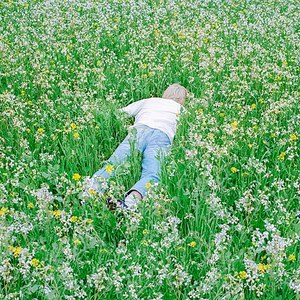
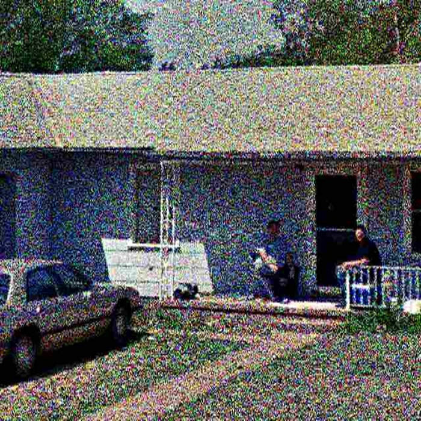
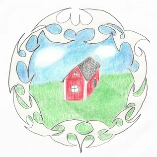
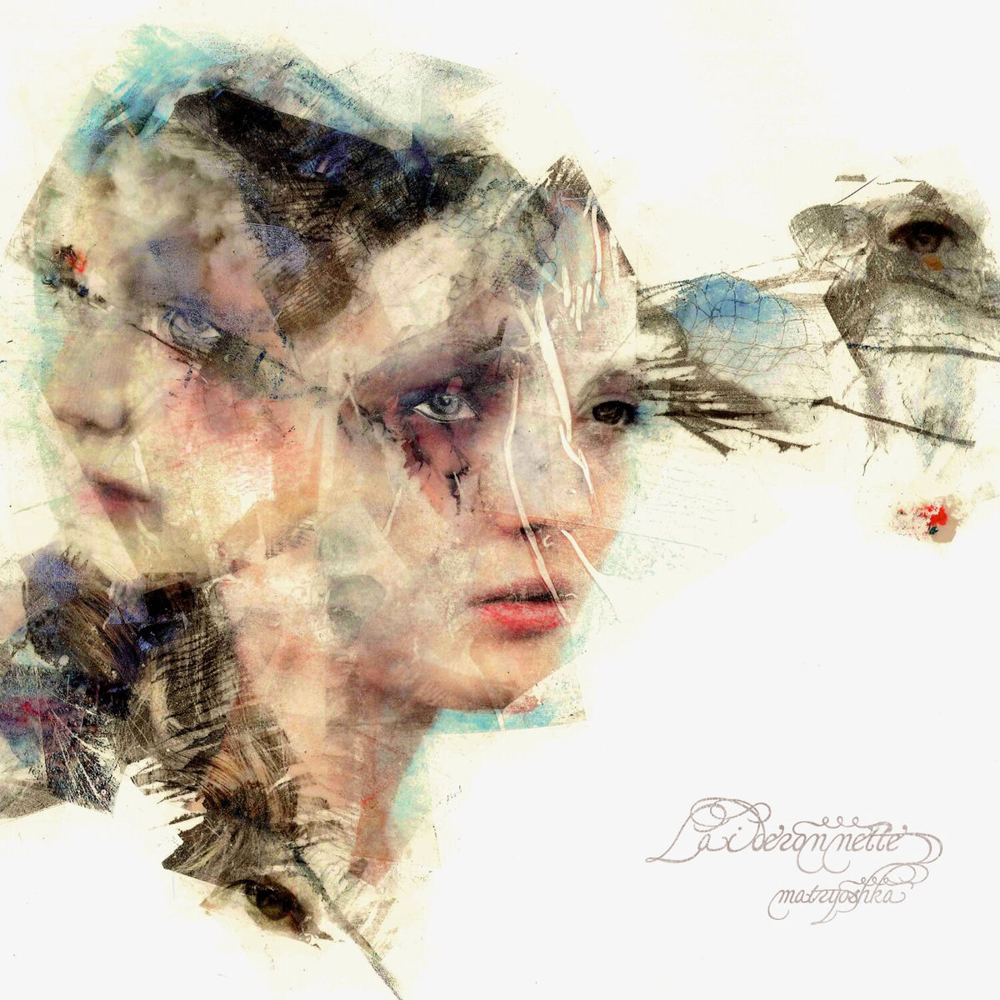
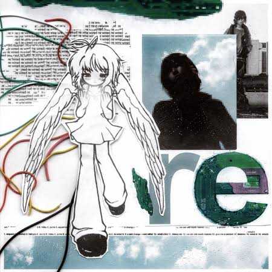

<html>
<head>
    <meta charset="UTF-8">
    <meta name="viewport" content="width=device-width, initial-scale=1.0">
    <title>Sophfishy's Fav Songs and Albums</title>
    
</head>
<body>

    

        
        <!-- 3D Flipping Card Stack -->
        

            
            <!-- Item 1 -->
            

                
            

            
            <!-- Item 2 -->
            

                
            

            
            <!-- Item 3 -->
            

                
            

            
            <!-- Item 4 -->
            

                
            

            
            <!-- Item 5 -->
            

                
            

        

        <!-- Dynamic Description Box -->
        

            <h2 id="galleryTitle">Loading...</h2>
            
Please wait.

        

        <!-- Visual Click Controls -->
        

            <button class="nav-btn" id="prevBtn">◀ PREV</button>
            <button class="nav-btn" id="nextBtn">NEXT ▶</button>
        

        
Or Use Left / Right Arrow Keys

    

    
</body>
</html>
